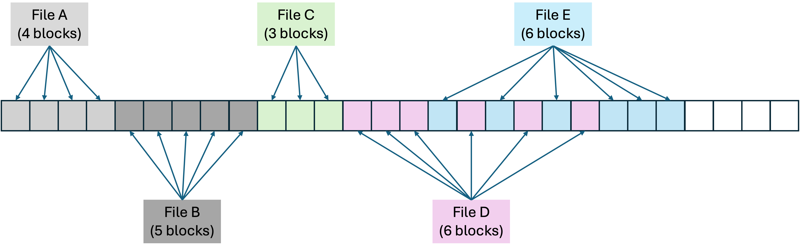
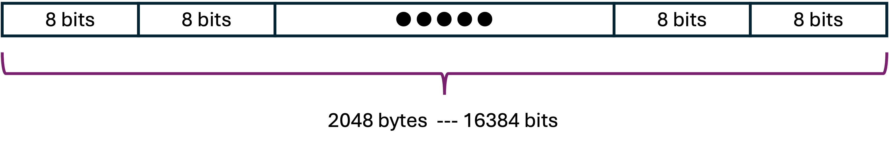
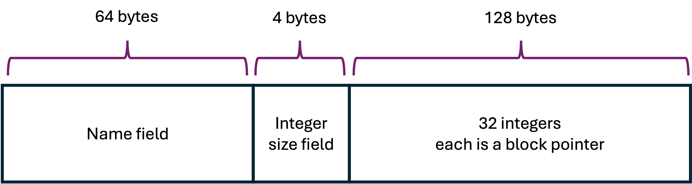
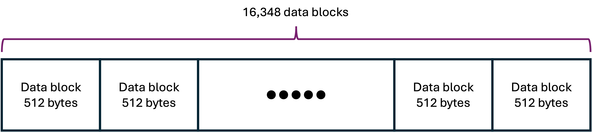

# Final Project: Designing a Simple File System

## Purpose

The purpose of this project is to give you an opportunity to apply concepts covered during the semester and put them to practice by synthesizing new material. Specifically the focus will be on mechanisms for allocation and accounting of system resources.   This project will also give you a chance to

1. Continue to develop your skills and ability to work on a team.
2. Enhance your communication skills by presenting your work to your peers.
3. Apply and implement concepts covered throughout the semester.  

## Introduction

Throughout the semester, we have seen in a number of places that sharing resources requires an accounting mechanism that keeps track of the resources handed out to various processes.  Examples of this include page replacement algorithms and process scheduling algorithms.  This project will revisit this concept in the context of a file system.  The accounting mechanism for a file system keeps track of the disk blocks that are available for use in holding file data.   In addition to the accounting mechanism, there is an algorithm for selecting the disk blocks that should be allocated when a request to write or store information to a disk is made.

This project deals with designing a simple flat direct access file system.  The objective is to focus on the accounting mechanism and not so much on the full design of the file system; however, you are responsible for understanding this particular design and the implementation provided.

## File Concept

A file is a logical storage unit abstracted by operating system from the physical properties of the storage device.  A file is the smallest unit of logical storage available on a secondary storage system.  Files have attributes associated with them that provide metadata about the particular file.  Different operating systems organize and utilize different attribute, but they usually consist of the following list.

- Name - Human-readable name used to reference the file.
- Identifier - A unique tag that is used to reference the file within the file system.
- Type - Used by operating systems that support different file types.
- Location - A pointer that identifies the device and location of the file on the device.
- Size - The current size of the file in bytes or other units such as blocks.
- Protection - The access-control information that determines users and processes that can read, write, or execute the file.
- Timestamp and user identification - Tracks creation, modification, and last access time.  Useful for additional protection of the file.

This project will deal only with **name**, **location**, and **size**.

## File System Structure

File systems utilize the same strategy that was used to avoid external fragamentation in main memory.  Files are stores in blocks of contiguous bytes.  The blocks are powers of 2,  usually 512 or 1024 bytes.  Some systems allocate larger blocks; however, the larger the block the greater the internal fragamentation.  There are reason for allocating larger blocks for certain applications, as that will yield improvement in transferring of data from the device to memory.  Some applications benefit from tuning the block size.  For this project, blocks are set to 512 (29) bytes in size.

Fig. 1 - File allocation using blocks

*Fig. 1* above shows the file structure used to store files on secondary storage.  Files may be allocated contiguous blocks, but this is not necessary.   Free blocks are allocating based on some algorithm.  Depending on the algorithm and the free blocks available, a file may have blocks that are not contiguously allocated as shown for **FILE D**  and **FILE E** in *Fig. 1*.

This project's file system structure, shown in *Fig. 2*, consists of a **free block** list,  an **inode** list, and a list of **data blocks**. 

Fig. 2 - File System file structure.

The file system begins with an array of bits representing the free block list.   The free block list uses a bit to represent the state of a data block.  Each data block has a corresponding bit in the free block list that can take on a value of `1` or `0`.  A `1` value means that a block is currently allocated to a file.  A `0` value means that a block is currently free to be used by any file.  The array of bits are grouped together 8 at a time into bytes.  There are a total of 16,384 data blocks in the file system and, thus, there are 16,384 bits in the free block list. Within the free block list, there is a 1-to-1 mapping between a bit and its corresponding data block.  For example, bit 2 corresponds to data block 2.  In order to extract a bit in the free list, you must first index the block it represents.

Fig. 3 - Free block list.

*Fig. 3* depicts the free block list. To find the status of data block 17, we know it is found in free block list bit 17.  Since the bits are grouped into bytes, we know that byte 0  holds bits 0-7, byte 1 holds bits 8-15.  To compute this, divide 17/8 to get the result of 2 with a remainder of 1.  This means that in order to find bit 17, you go to byte 1, offset  1.  The assumption is that there is a byte 0, byte 1, etc and there is an offset 0, 1, etc.

Fig. 4 - inode structure.

Next, in the file system structure is the inode list.  *Fig. 4* shows the inode structure.  The inode holds all the information about a file. There are a total of 1024 inodes in this file system.  Each inode has a specific format.   The inode begins with a name field, which is 64-bytes long.  This holds exactly 64 characters.  Therefore a filename can be a total of 64 characters long.   After the name field is an integer (4-bytes) that stores the file size.   After that, is an array of integers where each integer represents a block pointer.  A block pointer is an integer that holds the data block number.   The integer block pointers are stored by storing the 4-bytes that represent the integer.  You may assume that when the name field is null (all zeros) that the inode is unused.

Fig. 5 - Data blocks.

After the list of i-nodes, are the data blocks themselves.  Each data block is an array of 512 bytes as shown in *Fig. 5*.   The blocks are used to hold raw data values.  Whenever a string is written to a file, the string is first converted to bytes (String.getBytes()) and then written to the disk.  There are a total of 16,384 disk data blocks.

## What is Provided

The followind files are provided with this description.

- `Disk.java` - Manages the physical properties of the device.
- `FreeBlockList.java` - Manages the free block list.
- `INode.java` - Manages the inodes.
- `FileSystem.java` - Provides file system functionality.
- `Main.java` - Simulates creating, opening, deleting, writing of files and reading and writing to files.

## Test File

You should design tests to check your implementation.  Since the provided project folder is a Gradle based project, you may add test classes to test your implementation.  IntelliJ makes it very easy to add JUNIT5 unit test cases.

## Task To Be Completed

Read and understand the example Java code provided with this project.  You will be making modification to the following four methods in `FileSystem.java`,

- `read()`
- `write()`
- `allocateBlocksForFile()`
- `deallocateBlocksForFile()`

You may modify `FileSystem.java` in any way you like, but the signatures of the public methods **MAY NOT** be changed. 

Also, **DO NOT** make modifications to `Disk.java`, `FreeBlockList.java`, or `INode.java`.  You may modify `Main.java` in any way you like.  

For this project, you will 

1. Design a disk block allocation algorithm.  Think what it means to allocate blocks for a file, deallocate blocks for a file, and to read and write to a file.
2. Implement the following methods in `FileSystem.java`.
	
	<ol style="list-style-type: lower-alpha;">
	<li><code>read()</code> - read from a file.
	<li><code>write()</code> - write to a file.</li>
	<li><code>allocateBlocksForFile()</code> - allocates disk blocks for a file.</li>
	<li><code>deallocateBlocksForFile()</code> - deallocates disk blocks for a file</li>
	</ol>
	
3. Prepare a 5 minute PowerPoint presentation of your algorithms.  The presentation should include,

  <ol style="list-style-type: lower-alpha;">
  <li>A clear description of your design choice with illustrations and picture to help elucidate your algorithms.</li>
  <li>An explanation of each method and how they work.</li>
  <li>A description of all assumptions used in this implementation.</li>
  </ol>
  

  Be prepared to answer questions about any part of the implementation provided in this project.  This requires a clear understanding of the file system as provided, limitations, and improvements.

   
Make sure your presentation does not exceed 5 minutes.  **You will be asked to stop once your 5 minutes are up!**.

## Submission Requirements

Since this is a group project, only one member of the group should click the Use as template button to copy the repo to his/her GitHub account.  Add the other members as collaborators.  This allows all member to **clone** the templated repo to their laptop. Make sure to **add** mrasamny@desu.edu as a collaborator on the group repo. 

Each member of the group should select one of the four methods to implement.  The repo should have evidence of feature branch submission and pull request for each member of the group.  Since you will be working on the same file, conflicts will inevitably occur.  You should become familiar with how to resonlve these conflicts.  **As a precaution, DO NOT delete any local feature branches**, as you may need them should an error in conflict resolution occurs on the main branch on GitHub.

You should commit your code as you work on your program.  **Your finalized product should be on your Github repo with clear evidence that each member has submitted the work on their method**.

Your submission must include a makefile that creates the executable by default (i.e. when make is run on the command line without any arguments).  It should also include a clean command that cleans all .o and executable files.

After completing your work, submit your Github repo link on Blackboard. Your repo should show no submissions after the submission deadline. Any submissions after the deadline will result in an immediate zero (0) on the assignment. If your **program does not compile, you will receive a zero (0) on the assignment**.

## Project Rubric (80 points)

<table>
<thead>
<tr>
<td>Category</td><td>Not Available</td><td> Incomplete </td><td>Developing</td><td>Accomplished</td><td>Exemplary</td><td>Score</td>
</tr>
</thead>

<tbody>

<tr>
<th>Overall Project Implementation  (20 Points)</th> <td>Did not submit project</td> 
<td>Project has many errors. Implementation is confused with no conceptual understanding of what was implemented or how to implement the requirements.</td> 
<td>Project has some errors.  Implementation showed signs of some confusion with some conceptual understanding of what was implemented or how to implement the requirements.</td> 
<td>Project has no errors.  Implementation showed no signs of confusion or issues with conceptual understanding of what was implemented.</td>
<td>Project has not errors.  Has a clear conceptual understanding of what was implemented.  Went beyond what was provided and implemented an improved version of the project.</td>
<td></td>
</tr>
<!============== IMPLEMENTATION OF SOLUTION =====================>
<tr>
<td style="text-align:center;" colspan=7> Implementation of Solution </td>
</tr>
<! ----------------->
<tr>
<th>Implementation of <code>read</code> method   (15 Points)</th>
<td>Nothing provided or does not compile.</td>
<td>The method has many logical errors and does not perform the intended behavior.</td>
<td>The method has some logical errors and does not perform the intended behavior.</td>
<td>The method has one or two logical errors and mostly performs the intended behavior.</td>
<td>The method has no logical errors and performs the intended behavior.</td>
<td></td>
</tr>
<! ----------------->
<tr>
<th>Implementation of <code>write</code> method   (15 Points)</th>
<td>Nothing provided or does not compile.</td>
<td>The method has many logical errors and does not perform the intended behavior.</td>
<td>The method has some logical errors and does not perform the intended behavior.</td>
<td>The method has one or two logical errors and mostly performs the intended behavior.</td>
<td>The method has no logical errors and performs the intended behavior.</td>
<td></td>
</tr>
<! ----------------->
<tr>
<th>Implementation of <code>allocateBlocksForFile</code> method   (15 Points)</th>
<td>Nothing provided or does not compile.</td>
<td>The method has many logical errors and does not perform the intended behavior.</td>
<td>The method has some logical errors and does not perform the intended behavior.</td>
<td>The method has one or two logical errors and mostly performs the intended behavior.</td>
<td>The method has no logical errors and performs the intended behavior.</td>
<td></td>
</tr>
<! ----------------->
<tr>
<th>Implementation of <code>deallocateBlocksForFile</code> method   (15 Points)</th>
<td>Nothing provided or does not compile.</td>
<td>The method has many logical errors and does not perform the intended behavior.</td>
<td>The method has some logical errors and does not perform the intended behavior.</td>
<td>The method has one or two logical errors and mostly performs the intended behavior.</td>
<td>The method has no logical errors and performs the intended behavior.</td>
<td></td>
</tr>

</tbody>
</table>

## Group Project Presentation (20 Points)

The group project presntation rubric is provided in this project folder.

